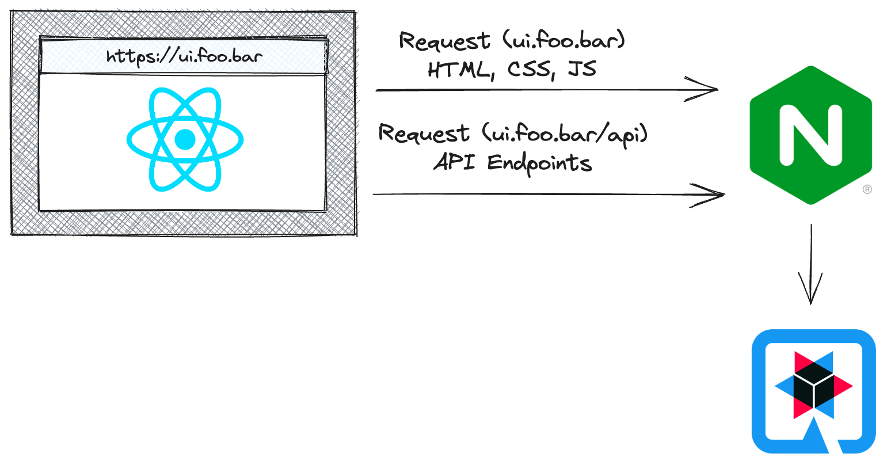

# Avoiding CORS with an NGINX Proxy

This repository contains a sample solution for avoid Cross-Origin Resource
Sharing (CORS) issues by serving your HTML, CSS, JavaScript, and API endpoints
from the same origin.

<div align="center">
  
</div>

## Deploy on OpenShift

Use the following commands to deploy this application on OpenShift, e.g th free
[OpenShift Developer Sandbox](https://developers.redhat.com/developer-sandbox):

```bash
# Get the current namespace/project name
export NAMESPACE=$(oc project -q)

# Set the target repository. If you fork the repository you can use your
# fork's URL in place of this URL
export SOURCE_REPOSITORY="https://github.com/evanshortiss/cors-nginx-blogpost"

# Deploy the frontend
oc process -f manifests/frontend.yaml -p NAMESPACE=$NAMESPACE -p SOURCE_REPOSITORY=$SOURCE_REPOSITORY | oc apply -f -

# Deploy the backend
oc process -f manifests/backend.yaml -p NAMESPACE=$NAMESPACE -p SOURCE_REPOSITORY=$SOURCE_REPOSITORY | oc apply -f -
```

## Local Development

Requirements:

* Node.js v18
* JDK v17
* Maven v3.8

Start the Quarkus backend:

```bash
cd quarkus-backend
./mvnw quarkus:dev
```

Then start the React frontend:

```bash
cd react-ui
npm run dev
```

## Enabling CORS on the Backend

If you'd like to experiment with CORS enabled on the Quarkus backend, you can configure CORS per the [Quarkus HTTP Reference](https://quarkus.io/guides/http-reference).

For example, to allow any domain to access the Quarkus backend:

```bash
QUARKUS_HTTP_CORS=true \
QUARKUS_HTTP_CORS_ORIGINS=* \
./mvnw quarkus:dev
```

Of course, the idea behind this example is to avoid the need to do this by using
NGINX as a proxy!